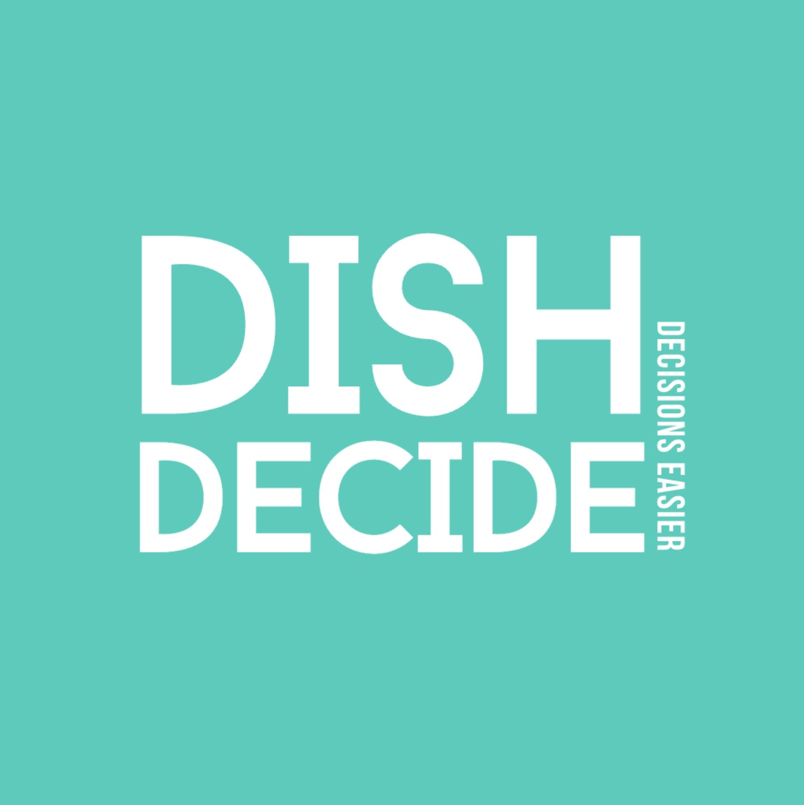
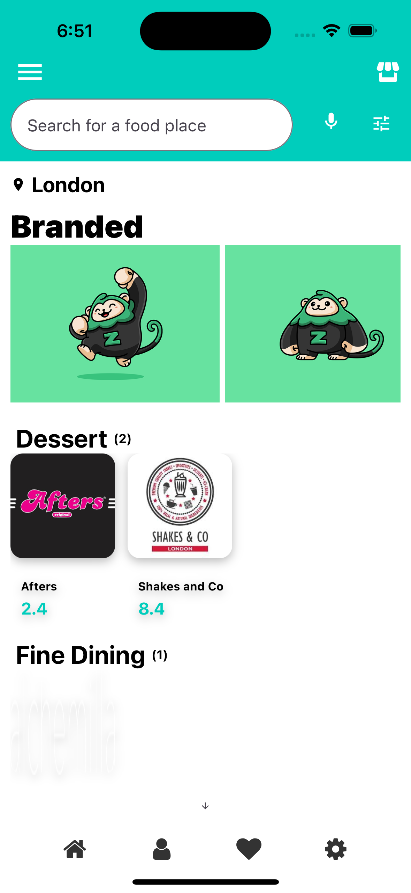
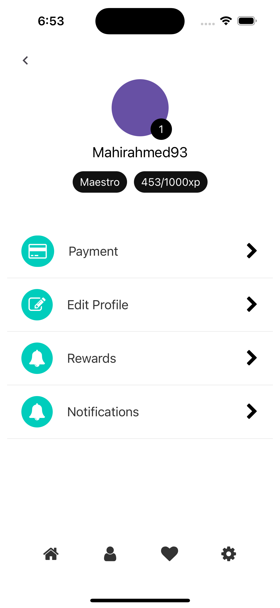
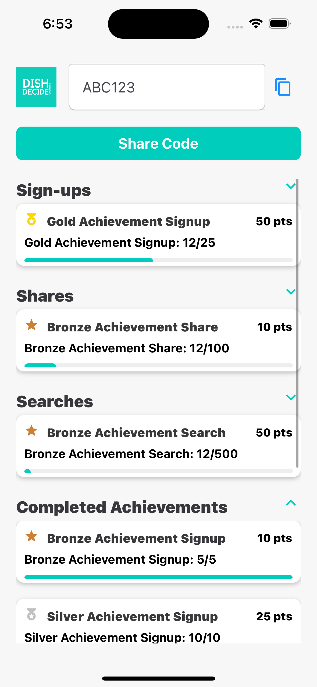
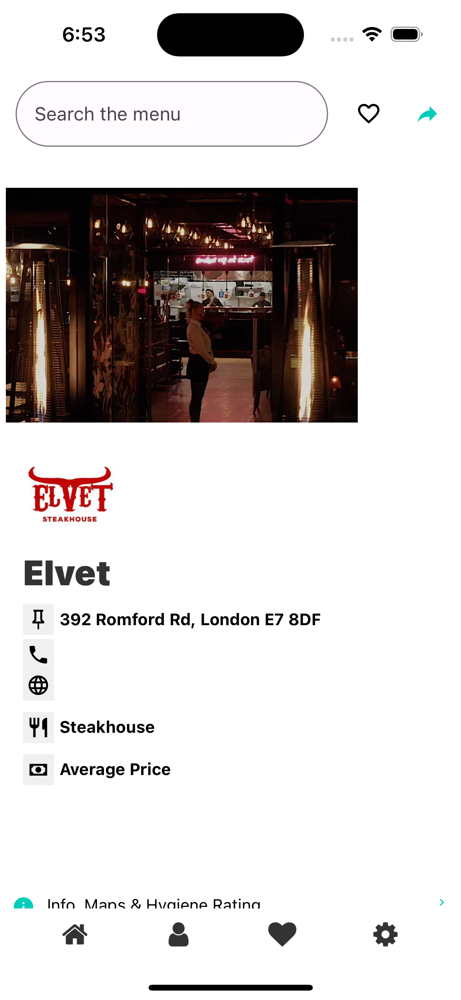

# DishDecide

Find what to eat faster, with less friction.

  

DishDecide is a mobile app that helps people go from "I don't know what to order" to a confident decision in seconds.  
Instead of forcing users to scroll endless menus, DishDecide lets them search the menu with natural prompts like:

- "Something hot and cheesy"
- "A light high-protein option"
- "Best spicy main under $$"

## Why It Exists

Food discovery today is noisy:
- Too many restaurants
- Too many menu items
- Too little relevance to what the user actually craves

DishDecide focuses on intent-first decisioning:
- prompt-led menu search
- personalized ranking
- cuisine-led restaurant discovery
- fast shortlist sharing with friends

## Product Experience

- **Home discovery**
  Browse curated cuisine rails and restaurant cards with quality-aware ranking.

- **Restaurant detail + menu intelligence**
  Search one restaurant's menu directly with natural language and get top picks instantly.

- **Taste profile personalization**
  Users set cuisine and dietary preferences that shape results across discovery and menu suggestions.

- **Favourites that are actually useful**
  Saved places are searchable/filterable and ready for quick return visits.

## Product Preview

  
  
  
  

## Differentiation

DishDecide is not a generic food listing UI.  
It is purpose-built around one core behavior: **decision confidence at ordering time**.

That means:
- less list noise
- more contextual ranking
- stronger prompt-to-result relevance
- cleaner path from craving to checkout decision

## Current Status

- iOS build and TestFlight pipeline configured through EAS
- Firebase-backed restaurant/profile data
- Admin tooling for data quality and enrichment workflows
- Ongoing refinement of ranking, menu matching, and onboarding UX

## Vision

DishDecide becomes the intelligent decision layer on top of restaurant menus:
- personal taste memory
- context-aware recommendations
- collaborative ordering flows (shareable picks)
- increasingly precise menu relevance over time
